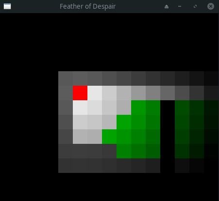
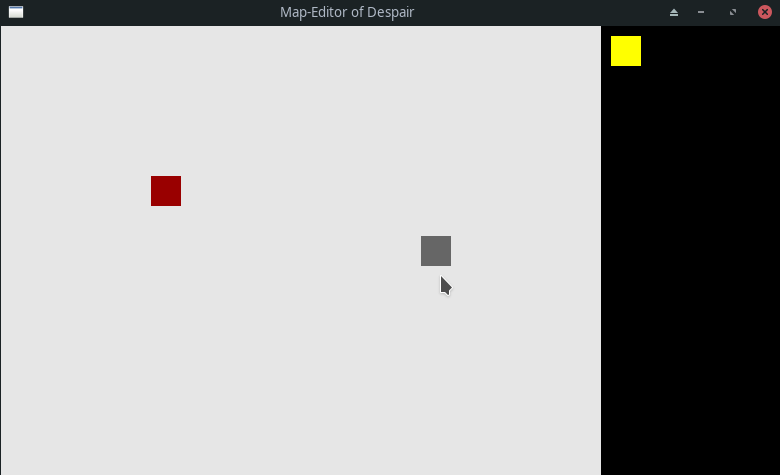

[](https://zuul.dhackz.org/t/dhackz/buildsets?project=dhackz%2Ffeather_of_despair&pipeline=post-merge)

# Feather of Despair

Feather of Despair is a 2D horror game written in rust using the [piston](https://github.com/PistonDevelopers/piston) game engine.

### Build
```
cargo run --bin map_of_despair      # To run the map editor.
cargo run --bin feather_of_despair  # To run the game.
```
Built using:
* cargo version 1.43.0
* rustc version 1.43.1
* piston version 0.98.0
* byteorder version 1.3.4

### Progress:
Track progress on [github](https://github.com/dhackz/feather_of_despair/projects/1)

## Current state:

**Game:**



**Map editor:**



