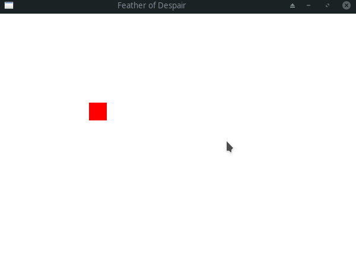

# Feather of Despair

Feather of Despair is a 2D horror game written in rust using the [piston](https://github.com/PistonDevelopers/piston) game engine.

### Build
```
cargo run
```
Built using:
* cargo version 1.43.0
* rustc version 1.43.1
* piston version 0.98.0

### Progress:
Track progress on [trello](https://trello.com/b/JS9bzLP3/featherofdespair).

## Iterations
**0.2.0:**


**0.1.0:**


