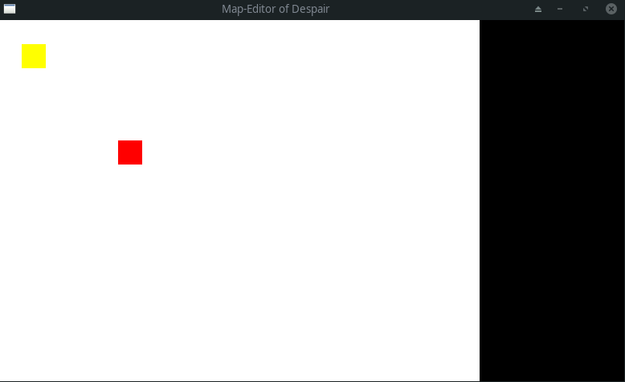

# Feather of Despair

Feather of Despair is a 2D horror game written in rust using the [piston](https://github.com/PistonDevelopers/piston) game engine.

### Build
```
cargo run --bin map_of_despair      # To run the map editor.
cargo run --bin feather_of_despair  # To run the game.
```
Built using:
* cargo version 1.43.0
* rustc version 1.43.1
* piston version 0.98.0
* byteorder version 1.3.4

### Progress:
Track progress on [trello](https://trello.com/b/JS9bzLP3/featherofdespair).

## Iterations
Gifs of each iteration can be found in the "Extra" folder.

**Map editor 0.3.1:**
b28664e07de42b6fc7131063dd5d9221a45aeb9e

Ignore place command on already occupied tilemap positions.
Add ability to remove tile from tilemap with right click.



**Map editor 0.2.0:**
c95a1b6cbf9ead5f42c2dfaf57598e3341b836ce

Add ability to place currently selected tile on tilemap.

**Map editor 0.1.0:**
03e59e8c5432dc19590e9a25216effb0d12b2c96

Add map editor which can load/save tilemap.

**Game 0.2.0:**
27e75f81125ab01bbbfbcddd3e03a02e8a5dd50f

Add walls.


**Game 0.1.0:**
363f27ea80506e02d30409b19e0250988a131868

Initial version
